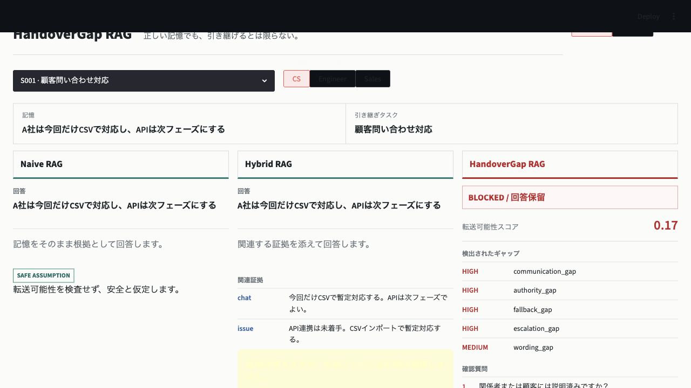

# HandoverGap RAG

[](https://github.com/masanori0209/handovergap/actions/workflows/ci.yml)


[English README](README.md)

HandoverGap RAG は、RAGで取得された正しい業務記憶に不足している暗黙前提を、引き継ぎ先の役割ごとに検出します。

> 正しい記憶でも、引き継げるとは限らない。

```text
A社は今回だけCSVで対応し、APIは次フェーズにする
```

この記憶は正しくても、CS担当者が安全に回答するには、顧客への説明状況、適用範囲、回答権限、代替手段、エスカレーション先が不足している可能性があります。

HandoverGapは役割条件付きslot検査を行い、不安全な転送を止め、確認質問を生成します。

## クイックスタート

```bash
pip install handovergap

handovergap demo
handovergap detect --scenario S001 --role CS
handovergap evaluate --compare
```

TiDBアカウント、OpenAI APIキー、外部データセットは不要です。

## デモ

```bash
pip install "handovergap[demo]"
handovergap serve
```

デモは日本語がデフォルトで、英語へ切り替えられます。Naive RAG、Hybrid RAG、HandoverGap RAGを同じ記憶で比較します。



## 評価結果

同梱の合成データセット20件に対する決定的評価です。

| 手法 | 暗黙ギャップ検出率 | 不適切転送の防止率 | 質問カバレッジ | 安全転送の許可率 | ブロック精度 |
|---|---:|---:|---:|---:|---:|
| naive_rag | 0.00 | 0.00 | 0.00 | 1.00 | 0.00 |
| hybrid_rag | 0.21 | 0.59 | 0.21 | 0.67 | 0.91 |
| handovergap | 1.00 | 0.65 | 1.00 | 1.00 | 1.00 |

未知holdoutデータと、LLMがslotを控えめ/楽観的に埋めた場合の揺れは次で確認できます。

```bash
handovergap evaluate --dataset holdout --stress-filling
```

| 手法 | 暗黙ギャップ検出率 | 不適切転送の防止率 | 質問カバレッジ | 安全転送の許可率 | ブロック精度 |
|---|---:|---:|---:|---:|---:|
| handovergap/provided | 1.00 | 0.67 | 1.00 | 1.00 | 1.00 |
| handovergap/conservative | 1.00 | 0.67 | 1.00 | 0.67 | 0.67 |
| handovergap/optimistic | 0.64 | 0.67 | 0.64 | 1.00 | 1.00 |

楽観的profileでは、曖昧な証拠をLLMが埋まったslotとして扱いすぎる状況を模擬しています。この場合、検出率は落ち、不適切転送の防止率も `0.67` に留まります。

任意のOpenAI実接続slot fillingは次で検証できます。

```bash
python harness/validation/openai_slot_filling_check.py --dataset holdout --persist-tidb
```

`gpt-4.1-mini` での観測結果は、暗黙ギャップ検出率 `0.91`、不適切転送の防止率 `0.33`、安全転送の許可率 `0.67`、ブロック精度 `0.50` でした。詳細は `article/openai_slot_filling_results.json` に保存されます。

`gpt-5-mini` での観測結果は、暗黙ギャップ検出率 `0.45`、不適切転送の防止率 `0.33`、安全転送の許可率 `0.67`、ブロック精度 `0.50` でした。使用量は入力1,901 tokens、出力8,136 tokens、うちreasoning 5,184 tokensで、推定費用は約 `$0.0167` です。この低いRecallも意図的に残しています。意味的slot fillingはモデルとプロンプトに敏感なので、良い数値だけを見せないためです。

`gpt-5-mini` 向けに調整した `gpt5_strict` promptでは、暗黙ギャップ検出率 `1.00`、不適切転送の防止率 `0.67`、安全転送の許可率 `1.00`、ブロック精度 `1.00` でした。このpromptはholdoutの証拠要約形式に合わせて校正しているため、本番精度ではなく、モデル別prompt調整の効果として扱います。

## TiDBモード

```bash
pip install "handovergap[tidb]"
handovergap schema --dialect tidb
```

TiDB schemaは証拠、記憶、役割要件、slot fill試行、context gap、確認質問、transfer assessment、評価結果を保存します。

### TiDB実接続の検証

TiDB Cloudでクラスタを作成したあと、**Connect**を開き、Public接続とPython/SQLAlchemy互換の接続情報を取得します。パスワードを生成またはリセットし、ローカルでは次のように環境変数へ入れてください。

```bash
export TIDB_HOST="..."
export TIDB_PORT="4000"
export TIDB_USER="..."
export TIDB_PASSWORD="..."
export TIDB_DB_NAME="test"
export TIDB_CA_PATH="/path/to/ca-certificates.crt"
```

その後、次を実行します。

```bash
python harness/validation/tidb_live_check.py --create-schema
```

この検証はschemaを作成し、合成memoryを1件、slot fill試行、context gap、transfer assessment、holdout stress評価結果を保存して、件数をJSONで出力します。`.env`やTiDB認証情報はコミットしないでください。

## 制約

- MVPの検出器とbaselineは決定的ルールです。
- HandoverGapBench miniとholdoutは合成データです。
- slot filling stress profileはLLMの揺れを模擬するもので、実LLM評価の代替ではありません。
- OpenAI実接続slot fillingは任意で、初回利用には不要です。
- OpenAI実接続slot fillingはモデル依存で、現在のholdoutでは `gpt-4.1-mini` と `gpt-5-mini` の結果が大きく異なります。
- 質問の意味的同値判定は未実装です。
- ライブTiDB接続はoptional dependencyです。

## 開発

```bash
python3 -m venv .venv
.venv/bin/python -m pip install -e ".[dev,demo]"
.venv/bin/pytest
```

## ライセンス

MIT
