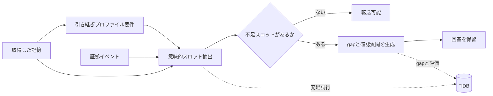

# 正しい記憶でも、引き継げるとは限らない：TiDBで作る HandoverGap RAG

Slackに、次のような記憶が残っていたとします。

```text
A社は今回だけCSVで対応し、APIは次フェーズにする
```

通常のRAGは、この記憶を正しく検索して回答できます。しかし、翌週から顧客対応を引き継ぐ人は、この一文だけで安全に回答できるでしょうか。

不足している可能性があります。

- 「今回だけ」が指す範囲
- 顧客にAPI延期を説明済みか
- 顧客向けに回答してよい範囲
- CSV対応が失敗した場合の代替手段
- 技術チームへのエスカレーション先

この記事では、このような **正しいが引き継げない記憶** を検出するための小さな評価基盤、HandoverGap RAGを実装します。

この記事の持ち帰りポイントは4つです。

1. 正しさと引き継ぎ可能性は別に測る。
2. 後任の責任範囲ごとに必須スロットを定義する。
3. 不足情報をLLMで補完せず、確認質問へ変換する。
4. TiDBにスロット抽出、gap、質問、transfer判断を残し、あとから説明できるようにする。

## CorrectnessとTransferabilityは異なる

RAGの代表的な評価軸には、検索関連度や回答正確性があります。業務引き継ぎでは、もう一つ確認したい軸があります。

```text
Correctness != Transferability
```

記憶が正しく、関連していて、矛盾していなくても、別の責任範囲を持つ人が運用するための暗黙前提が足りないことがあります。本プロジェクトでは、この不足を **Tacit Context Gap** と呼びます。

既存のRAG評価を否定したいわけではありません。検索関連度や回答正確性は必要です。ただし業務引き継ぎでは、その上に **transferability-specific metrics** を追加しないと、「正しいが後任には危ない記憶」を見逃します。

| 方式 | 見ているもの | 取りこぼしやすいもの |
|---|---|---|
| Naive RAG | 関連する記憶を返す | 後任が安全に使えるか |
| Hybrid RAG | 関連証拠や警告を足す | 引き継ぎプロファイルごとの不足前提 |
| 一般的なContext Engineering | promptや文脈の渡し方を改善する | なぜ回答を止めたかの監査証跡 |
| HandoverGap RAG | 回答前に必須スロットを検査する | 本番利用には組織ごとのannotation調整が必要 |

## 引き継ぎ先の責任範囲によって必要情報は変わる

同じ記憶でも、顧客に説明する人、技術運用を引き継ぐ人、商談を引き継ぐ人では確認すべき内容が異なります。

サポート引き継ぎプロファイルで必要なスロット:

- communication_status
- scope
- authority
- fallback_plan
- escalation_path
- customer_facing_wording

技術運用引き継ぎプロファイルで必要なスロット:

- rationale
- technical_constraint
- implementation_scope
- trigger_for_reconsideration
- related_issue
- failure_modes

HandoverGapは、引き継ぎプロファイルに必要なスロットを読み込み、記憶と証拠で埋まらないスロットをgapへ変換します。gapごとに確認質問を生成し、重要な前提が不足していれば回答を保留します。



## Naive RAGは答え、HandoverGapは止まる

```bash
handovergap detect --scenario S001 --role CS
```

このコマンドは元の記憶に加え、`communication_gap`、`authority_gap`、`fallback_gap`などを表示します。転送状態は`blocked`になります。

Streamlitデモでは、同じ記憶を三列で比較します。

1. Naive RAGは記憶をそのまま回答する
2. Hybrid RAGは関連証拠と警告を加える
3. HandoverGap RAGは不足スロットを示し、回答を保留して質問する

デモは日本語をデフォルトとし、英語へ切り替えられます。

## TiDBを単なるVector Storeにしない

HandoverGapで追跡したいのは最終回答だけではありません。

- どの証拠を検索したか
- どのスロットを埋めようとしたか
- どのスロットが不足したか
- どのgapを検出したか
- どの確認質問を生成したか
- 最終的に転送を許可したか

そのため、TiDBをスロット、証拠、gapの監査ストアとして設計しました。

主要テーブル:

```text
source_events
memory_items
memory_chunks
successor_role_requirements
memory_slots
slot_fill_attempts
context_gaps
clarification_questions
transfer_assessments
evaluation_runs
```

`memory_chunks`にはVector列、証拠メタデータや検索結果IDにはJSON、状態管理にはSQLとindexを使います。

```bash
handovergap schema --dialect tidb
```

ローカルMVPではTiDBを必須にしていません。ライブ接続を使う場合だけoptional dependencyを導入します。

```bash
pip install "handovergap[tidb]"
```

ライブ検証ではTiDB CloudのDeveloper Tierに接続し、同梱schemaの作成、合成memoryの保存、スロット抽出試行、context gap、transfer assessment、評価結果の保存まで確認しました。

```json
{
  "status": "ok",
  "inserted": {
    "slot_fill_attempts": 1,
    "context_gaps": 1,
    "transfer_assessments": 1,
    "evaluation_runs": 3
  },
  "counts": {
    "slot_fill_attempts": 1,
    "context_gaps": 1,
    "transfer_assessments": 1
  }
}
```

さらに、TiDB上では「なぜ回答を止めたか」をSQLで追えます。

```bash
handovergap audit-sql
```

出力される監査クエリの要点は、`transfer_assessments` から `memory_items`、`context_gaps`、`slot_fill_attempts`、`source_events`、`clarification_questions` を横断することです。

```sql
SELECT
  ta.status AS transfer_status,
  ta.transferability_score,
  mi.scenario_id,
  mi.subject,
  ta.successor_role,
  cg.gap_type,
  cg.slot_name,
  cg.severity,
  sfa.status AS slot_fill_status,
  sfa.retrieved_event_ids,
  se.title AS selected_evidence_title,
  cq.question
FROM transfer_assessments ta
JOIN memory_items mi
  ON mi.id = ta.memory_item_id
LEFT JOIN context_gaps cg
  ON cg.memory_item_id = ta.memory_item_id
 AND cg.successor_role = ta.successor_role
LEFT JOIN slot_fill_attempts sfa
  ON sfa.memory_item_id = cg.memory_item_id
 AND sfa.successor_role = cg.successor_role
 AND sfa.slot_name = cg.slot_name
LEFT JOIN source_events se
  ON se.id = sfa.selected_event_id
LEFT JOIN clarification_questions cq
  ON cq.context_gap_id = cg.id
WHERE ta.status = 'blocked';
```

これは単なるVector Store利用ではなく、SQL、Vector、JSON、関係スキーマを同じTiDB上で扱うための設計です。読者が知りたい「記憶は取れているのに、なぜ回答を止めたのか」に、評価ログから答えられます。

## HandoverGapBench mini

再現可能な比較のため、20件の合成シナリオを同梱しました。

- 引き継ぎプロファイル: CS / Engineer / Sales
- memory type: decision / procedure / risk / task
- 正解データ: gold gaps / gold questions / unsafe transfer label

評価指標は次の3つです。

- Tacit Gap Recall: gold gapを検出できた割合
- Unsafe Transfer Prevention: unsafeな記憶の転送を止めた割合
- Question Coverage: gold questionに対応する質問を生成した割合
- Safe Transfer Allowance: 安全な記憶を止めずに通せた割合
- Blocked Precision: ブロックした記憶のうち実際にunsafeだった割合

## 比較結果

2026年6月14日に次を実行しました。

```bash
handovergap evaluate --compare
```

| Method | Tacit Gap Recall | Unsafe Transfer Prevention | Question Coverage | Safe Transfer Allowance | Blocked Precision |
|---|---:|---:|---:|---:|---:|
| naive_rag | 0.00 | 0.00 | 0.00 | 1.00 | 0.00 |
| hybrid_rag | 0.21 | 0.59 | 0.21 | 0.67 | 0.91 |
| handovergap | 1.00 | 0.65 | 1.00 | 1.00 | 1.00 |

この結果は、HandoverGapが本番環境でも100%正しいことを意味しません。データセットと決定的ルールを一緒に設計したMVPの整合性検査です。ただし、ここで見たいのは高い数値そのものではなく、「RAG評価にはtransferability-specific metricsが必要」という問題設定を再現可能な形で測れることです。

そのため追加で、既存20件とは別のholdoutデータを用意しました。holdoutには合成reviewer A/Bのスロットラベルとadjudicated goldを持たせ、さらにLLMの意味的スロット抽出で起きやすい揺れを3 profileで模擬しています。

```bash
handovergap evaluate --dataset holdout --stress-filling
```

| Method | Tacit Gap Recall | Unsafe Transfer Prevention | Question Coverage | Safe Transfer Allowance | Blocked Precision |
|---|---:|---:|---:|---:|---:|
| handovergap/provided | 1.00 | 0.67 | 1.00 | 1.00 | 1.00 |
| handovergap/conservative | 1.00 | 0.67 | 1.00 | 0.67 | 0.67 |
| handovergap/optimistic | 0.64 | 0.67 | 0.64 | 1.00 | 1.00 |

`optimistic` profileは、曖昧な証拠をLLMが「スロットが埋まっている」と楽観的に解釈する状況を模擬しています。このときTacit Gap RecallとQuestion Coverageは0.64まで落ち、Unsafe Transfer Preventionも0.67に留まりました。これは良い意味で、機構の弱点を隠していません。

さらにOpenAI APIを使った実LLMによる意味的スロット抽出も任意検証として実行しました。

```bash
python harness/validation/openai_slot_filling_check.py --dataset holdout --persist-tidb
```

実行したモデルごとの結果:

| Method | Scenarios | Tacit Gap Recall | Unsafe Transfer Prevention | Safe Transfer Allowance | Blocked Precision |
|---|---:|---:|---:|---:|---:|
| handovergap/openai-slot-fill/gpt-4.1-mini | 6 | 0.91 | 0.33 | 0.67 | 0.50 |
| handovergap/openai-slot-fill/gpt-5-mini | 6 | 0.45 | 0.33 | 0.67 | 0.50 |
| handovergap/openai-slot-fill/gpt-5-mini/gpt5_strict | 6 | 1.00 | 0.67 | 1.00 | 1.00 |

実LLMでは、`gpt-4.1-mini` は単純な`optimistic` profileよりTacit Gap Recallが改善しました。一方でUnsafe Transfer Preventionは0.33、Blocked Precisionは0.50まで落ちました。さらに `gpt-5-mini` では、同じpromptでもTacit Gap Recallが0.45まで下がりました。詳細ログを見ると、LLMが契約影響や判断理由を楽観的に埋めすぎるケースと、安全なhandoverでも`needs_clarification`に寄るケースがありました。

そこで `gpt-5-mini` 向けに、スロットごとの受理条件、未確定情報をfilledにしない条件、合成holdoutの証拠要約をどう扱うかをpromptへ追加しました。その結果、Tacit Gap Recallは1.00まで改善しました。ただし、このpromptはholdoutのannotation protocolに近づいているため、本番精度ではなく「モデル別prompt調整が効く」という証拠として扱うべきです。また安全ケース `U006` では不要な `timeline_confidence` gapを出しており、現在のheadline metricsは過剰な確認質問を十分に罰していません。

`gpt-5-mini` の初回6件検証では、入力1,901 tokens、出力8,136 tokens、うちreasoning 5,184 tokensを使用し、推定費用は約 $0.0167 でした。調整後promptでは、入力4,351 tokens、出力8,803 tokens、うちreasoning 6,400 tokensで、推定費用は約 $0.0187 でした。費用は小さい一方、結果の揺れは大きい。これは「意味的スロット抽出は効く可能性があるが、モデル選択、prompt、ブロック判定ポリシー、スロット定義、評価指標にはまだ改善余地が大きい」という示唆です。

## PyPIから試す

英語を主READMEとし、日本語READMEも同梱します。

GitHub: https://github.com/masanori0209/handovergap
PyPI: https://pypi.org/project/handovergap/

```bash
pip install handovergap
handovergap demo
handovergap detect --scenario S001 --role CS
handovergap evaluate --compare
```

デモを起動する場合:

```bash
pip install "handovergap[demo]"
handovergap serve
```

OpenAIによる意味的スロット抽出とTiDBへの監査保存まで画面から試す場合:

```bash
pip install "handovergap[live]"
handovergap serve
```

実LLM + TiDBモードでは、架空の引き継ぎケースに対して次の処理を行います。

1. 取得した記憶と関連証拠を表示
2. OpenAI modelでプロファイルに必要なスロットを意味的に抽出
3. HandoverGap detectorで不足スロット、確認質問、transferabilityを判定
4. slot_fill_attempts、context_gaps、transfer_assessmentsをTiDBへ保存

この実LLM + TiDBデモは `gpt-5-mini` とTiDB Cloud Developer Tierで疎通確認済みです。画面は日本語をデフォルトにし、英語へ切り替えられます。ローカルサンプルでは「サポート引き継ぎ」「技術運用引き継ぎ」「商談引き継ぎ」として表示し、コード上の `CS` / `Engineer` / `Sales` は同梱プリセットIDとして扱います。最新のPyPI版では `handovergap==0.1.4` として公開します。

## 実装して分かったこと

### 1. 不足情報を回答文で補わない

暗黙前提がない場合、もっともらしい回答を生成するのではなく、`missing`として残す必要があります。HandoverGapでは「ためらうこと」を機能として扱います。

### 2. 引き継ぎプロファイルに条件づけなければ評価にならない

情報の充足度を一律に測るだけでは、顧客説明には必要だが技術運用には不要な情報を区別できません。

### 3. 評価過程を保存すると説明できる

gapから不足スロット、プロファイル要件、検索した証拠、生成質問へ辿れると、なぜ回答を止めたかを説明できます。ここがTiDBを使う主要な理由です。

## 限界

- HandoverGapBench miniは合成データです。
- gold gapの定義には主観が入ります。
- CLIの初回体験は決定的ルールで動き、OpenAIやTiDBを必須にしません。
- Streamlitの実LLM + TiDBモードと検証スクリプトでは、OpenAIによる意味的スロット抽出を実行できます。
- LLMがスロットを控えめ/楽観的に埋めた場合の揺れはholdout stress profileで模擬し、任意のOpenAI実接続でも検証しています。
- Question Coverageはスロット一致で評価し、意味的同値判定は行いません。
- 組織ごとに引き継ぎプロファイル要件と重要度の調整が必要です。
- 実データではプライバシー、アクセス制御、保持期間の設計が必要です。
- ライブTiDBへのschema作成、評価結果保存、実LLM + TiDBデモからのスロット/gap/transfer監査保存は検証済みですが、負荷・障害試験は今後の課題です。

これらは「だから使えない」という話ではなく、HandoverGapの評価軸を現実の組織に持ち込むための次のannotation課題です。特に、過剰な確認質問をどう罰するか、プロファイル要件をどう運用で更新するか、監査ログをどの保持期間で残すかは今後の改善点です。

## まとめ

RAGが正しい記憶を返しても、その記憶が後任者にとって安全に利用できるとは限りません。

HandoverGap RAGは、引き継ぎ先の責任範囲ごとに不足する暗黙前提を検出し、回答する前に確認質問へ変換します。

> Naive RAGは答える。HandoverGap RAGは、足りない前提を聞き返す。
