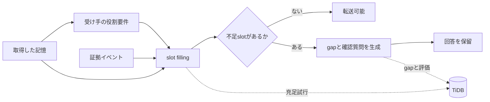

# 正しい記憶でも、引き継げるとは限らない：TiDBで作る HandoverGap RAG

Slackに、次のような記憶が残っていたとします。

```text
A社は今回だけCSVで対応し、APIは次フェーズにする
```

通常のRAGは、この記憶を正しく検索して回答できます。しかし、翌週から顧客対応を引き継ぐCS担当者は、この一文だけで安全に回答できるでしょうか。

不足している可能性があります。

- 「今回だけ」が指す範囲
- 顧客にAPI延期を説明済みか
- CSが回答してよい範囲
- CSV対応が失敗した場合の代替手段
- 技術チームへのエスカレーション先

この記事では、このような **正しいが引き継げない記憶** を検出するための小さな評価基盤、HandoverGap RAGを実装します。

## CorrectnessとTransferabilityは異なる

RAGの代表的な評価軸には、検索関連度や回答正確性があります。業務引き継ぎでは、もう一つ確認したい軸があります。

```text
Correctness != Transferability
```

記憶が正しく、関連していて、矛盾していなくても、別の役割の人が運用するための暗黙前提が足りないことがあります。本プロジェクトでは、この不足を **Tacit Context Gap** と呼びます。

## 受け手の役割によって必要情報は変わる

同じ記憶でも、CSとEngineerとSalesでは確認すべき内容が異なります。

CSに必要なslot:

- communication_status
- scope
- authority
- fallback_plan
- escalation_path
- customer_facing_wording

Engineerに必要なslot:

- rationale
- technical_constraint
- implementation_scope
- trigger_for_reconsideration
- related_issue
- failure_modes

HandoverGapは、受け手の役割に必要なslotを読み込み、記憶と証拠で埋まらないslotをgapへ変換します。gapごとに確認質問を生成し、重要な前提が不足していれば回答を保留します。



## Naive RAGは答え、HandoverGapは止まる

```bash
handovergap detect --scenario S001 --role CS
```

このコマンドは元の記憶に加え、`communication_gap`、`authority_gap`、`fallback_gap`などを表示します。転送状態は`blocked`になります。

Streamlitデモでは、同じ記憶を三列で比較します。

1. Naive RAGは記憶をそのまま回答する
2. Hybrid RAGは関連証拠と警告を加える
3. HandoverGap RAGは不足slotを示し、回答を保留して質問する

デモは日本語をデフォルトとし、英語へ切り替えられます。

## TiDBを単なるVector Storeにしない

HandoverGapで追跡したいのは最終回答だけではありません。

- どの証拠を検索したか
- どのslotを埋めようとしたか
- どのslotが不足したか
- どのgapを検出したか
- どの確認質問を生成したか
- 最終的に転送を許可したか

そのため、TiDBをslot/evidence/gapの監査ストアとして設計しました。

主要テーブル:

```text
source_events
memory_items
memory_chunks
successor_role_requirements
memory_slots
slot_fill_attempts
context_gaps
clarification_questions
transfer_assessments
evaluation_runs
```

`memory_chunks`にはVector列、証拠メタデータや検索結果IDにはJSON、状態管理にはSQLとindexを使います。

```bash
handovergap schema --dialect tidb
```

ローカルMVPではTiDBを必須にしていません。ライブ接続を使う場合だけoptional dependencyを導入します。

```bash
pip install "handovergap[tidb]"
```

ライブ検証ではTiDB CloudのDeveloper Tierに接続し、同梱schemaの作成、合成memoryの保存、slot fill試行、context gap、transfer assessment、評価結果の保存まで確認しました。

```json
{
  "status": "ok",
  "inserted": {
    "slot_fill_attempts": 1,
    "context_gaps": 1,
    "transfer_assessments": 1,
    "evaluation_runs": 3
  },
  "counts": {
    "slot_fill_attempts": 1,
    "context_gaps": 1,
    "transfer_assessments": 1
  }
}
```

## HandoverGapBench mini

再現可能な比較のため、20件の合成シナリオを同梱しました。

- 役割: CS / Engineer / Sales
- memory type: decision / procedure / risk / task
- 正解データ: gold gaps / gold questions / unsafe transfer label

評価指標は次の3つです。

- Tacit Gap Recall: gold gapを検出できた割合
- Unsafe Transfer Prevention: unsafeな記憶の転送を止めた割合
- Question Coverage: gold questionに対応する質問を生成した割合
- Safe Transfer Allowance: 安全な記憶を止めずに通せた割合
- Blocked Precision: ブロックした記憶のうち実際にunsafeだった割合

## 比較結果

2026年6月14日に次を実行しました。

```bash
handovergap evaluate --compare
```

| Method | Tacit Gap Recall | Unsafe Transfer Prevention | Question Coverage | Safe Transfer Allowance | Blocked Precision |
|---|---:|---:|---:|---:|---:|
| naive_rag | 0.00 | 0.00 | 0.00 | 1.00 | 0.00 |
| hybrid_rag | 0.26 | 0.59 | 0.26 | 1.00 | 1.00 |
| handovergap | 1.00 | 1.00 | 1.00 | 1.00 | 1.00 |

この結果は、HandoverGapが本番環境でも100%正しいことを意味しません。データセットと決定的ルールを一緒に設計したMVPの整合性検査です。

そのため追加で、既存20件とは別のholdoutデータを用意しました。holdoutには合成reviewer A/Bのslotラベルとadjudicated goldを持たせ、さらにLLMのslot fillingで起きやすい揺れを3 profileで模擬しています。

```bash
handovergap evaluate --dataset holdout --stress-filling
```

| Method | Tacit Gap Recall | Unsafe Transfer Prevention | Question Coverage | Safe Transfer Allowance | Blocked Precision |
|---|---:|---:|---:|---:|---:|
| handovergap/provided | 1.00 | 1.00 | 1.00 | 1.00 | 1.00 |
| handovergap/conservative | 1.00 | 1.00 | 1.00 | 1.00 | 1.00 |
| handovergap/optimistic | 0.64 | 1.00 | 0.64 | 1.00 | 1.00 |

`optimistic` profileは、曖昧な証拠をLLMが「slotが埋まっている」と楽観的に解釈する状況を模擬しています。このときTacit Gap RecallとQuestion Coverageは0.64まで落ちました。これは良い意味で、機構の弱点を隠していません。一方で、このholdoutではUnsafe Transfer PreventionとBlocked Precisionは1.00を維持しました。

さらにOpenAI APIを使った実LLM slot fillingも任意検証として実行しました。

```bash
python harness/validation/openai_slot_filling_check.py --dataset holdout --persist-tidb
```

`gpt-4.1-mini` での結果:

| Method | Scenarios | Tacit Gap Recall | Unsafe Transfer Prevention | Safe Transfer Allowance | Blocked Precision |
|---|---:|---:|---:|---:|---:|
| handovergap/openai-slot-fill/gpt-4.1-mini | 6 | 0.82 | 1.00 | 1.00 | 1.00 |

実LLMでは、単純な`optimistic` profileよりTacit Gap Recallが改善しました。一方で詳細ログを見ると、安全なhandoverでも`needs_clarification`に寄るケースがありました。これは「危険な引き継ぎを止める」方向には効いているが、「止めすぎない」ためのslot定義や証拠粒度にはまだ改善余地がある、という示唆です。

## PyPIから試す

英語を主READMEとし、日本語READMEも同梱します。

GitHub: https://github.com/masanori0209/handovergap
PyPI: https://pypi.org/project/handovergap/

```bash
pip install handovergap
handovergap demo
handovergap detect --scenario S001 --role CS
handovergap evaluate --compare
```

デモを起動する場合:

```bash
pip install "handovergap[demo]"
handovergap serve
```

## 実装して分かったこと

### 1. 不足情報を回答文で補わない

暗黙前提がない場合、もっともらしい回答を生成するのではなく、`missing`として残す必要があります。HandoverGapでは「ためらうこと」を機能として扱います。

### 2. role-conditionedでなければ引き継ぎ評価にならない

情報の充足度を一律に測るだけでは、CSには必要だがEngineerには不要な情報を区別できません。

### 3. 評価過程を保存すると説明できる

gapからmissing slot、role requirement、検索した証拠、生成質問へ辿れると、なぜ回答を止めたかを説明できます。ここがTiDBを使う主要な理由です。

## 限界

- HandoverGapBench miniは合成データです。
- gold gapの定義には主観が入ります。
- 現在のMVPは決定的ルールで、LLMによる意味的slot fillingは行いません。
- ただし、LLMがslotを控えめ/楽観的に埋めた場合の揺れはholdout stress profileで模擬し、任意のOpenAI実接続slot fillingも検証スクリプトとして追加しています。
- Question Coverageはslot一致で評価し、意味的同値判定は行いません。
- 組織ごとに役割要件と重要度の調整が必要です。
- 実データではプライバシー、アクセス制御、保持期間の設計が必要です。
- ライブTiDBへのschema作成と最小書き込みは検証済みですが、負荷・障害試験は今後の課題です。

## まとめ

RAGが正しい記憶を返しても、その記憶が後任者にとって安全に利用できるとは限りません。

HandoverGap RAGは、受け手の役割ごとに不足する暗黙前提を検出し、回答する前に確認質問へ変換します。

> Naive RAGは答える。HandoverGap RAGは、足りない前提を聞き返す。
